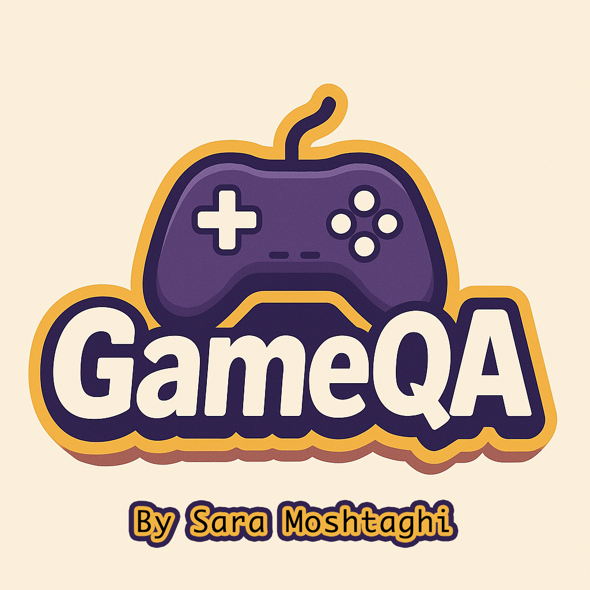

# 🎮 GameQA — Question Answering on Gaming Texts with BERT

GameQA is a fine-tuned BERT-based Question Answering system trained to understand and extract answers from gaming-related documents and texts. Whether you're asking about a game’s release date or a character's background, GameQA finds the right answer directly from the content.

## 📌 Project Goal

The goal is to build a domain-specific QA model that can:
- Understand questions about video games
- Retrieve short, accurate answers from related text
- Leverage the power of transformer-based models for extractive QA

## 🧠 Model

- Base model: `bert-base-uncased`
- Fine-tuned for Question Answering using Hugging Face Trainer
- Trained on a custom dataset of QA pairs from gaming contexts

## 🛠️ Tools & Libraries

- Python 🐍
- Hugging Face Transformers 🤗
- PyTorch
- scikit-learn
- Datasets

## 🗂️ Project Structure

